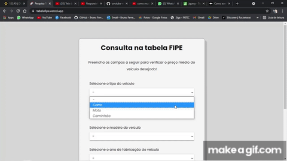

<h1 align="center">ConsultaTabelaFIPE</h1>

[](https://github.com/BrunoFerreira44/WhatsappMessageSender/main/LICENSE)

<h1 align="center">

</h1>

<h3 align="center">Acesse o Site: <a href="https://tabelafipe.vercel.app" target="_blank">tabelafipe.vercel.app</a></h3>

---
  
## 🛠 Sobre o projeto

Consulta de valor veícular na tabela FIPE via API com JavaScript

---

## 🚀 Tecnologias

• JavaScript

• [API pública da tabela FIPE](http://deividfortuna.github.io/fipe/)

---

## ⚙ Configurações

```
   #Clone e instalação do projeto
      git clone https://github.com/BrunoFerreira44/ConsultaTabelaFIPE.git
      cd ConsultaTabelaFIPE/

   #Execução
      cd src/
      Abrir o arquivo "index.html"
```

---

## 🙇‍♂️ Autor

**Bruno Ferreira**

LinkedIn: _[Bruno Ferreira](https://www.linkedin.com/in/brunoferreira3003/)_
